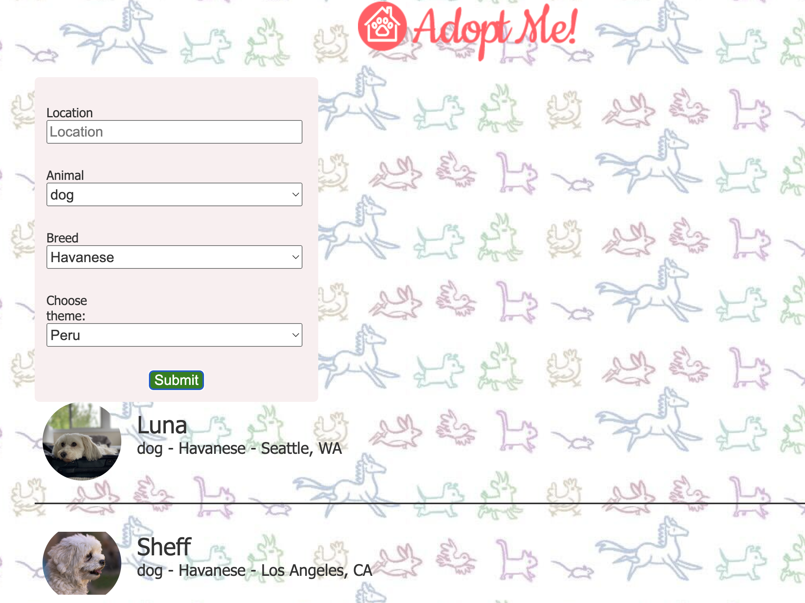
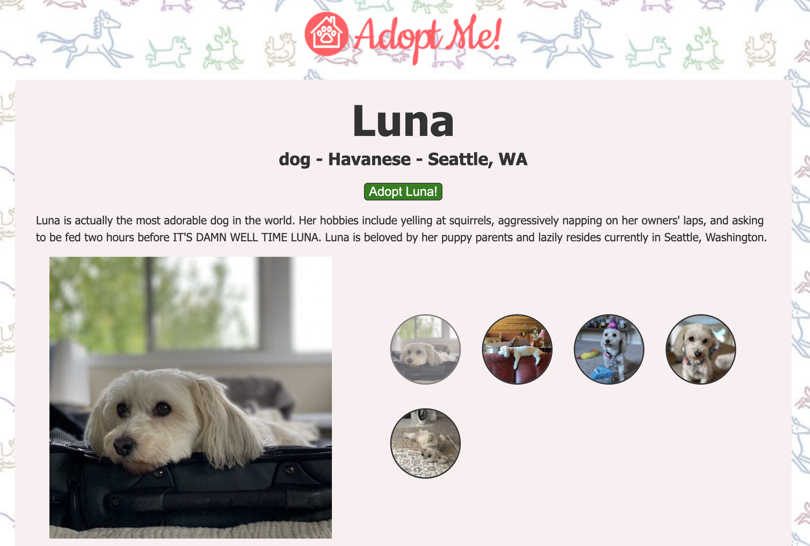
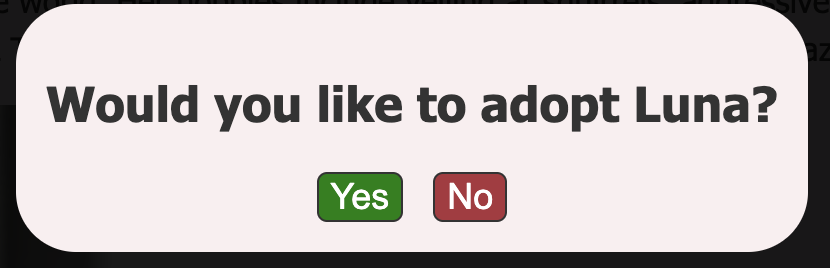

# Adopt me
React application to adopt animals based on their breeds and location.

## Tech stack
- React js
- REST API

## How to run:
- `git clone git@github.com:karolina-rachuta/adopt_me.git`
- `npm install`
- `npm run dev`
- profit!

## Screenshots:

