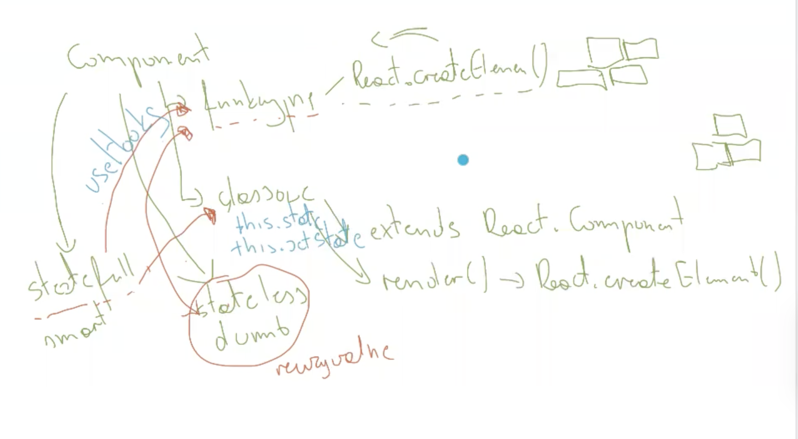
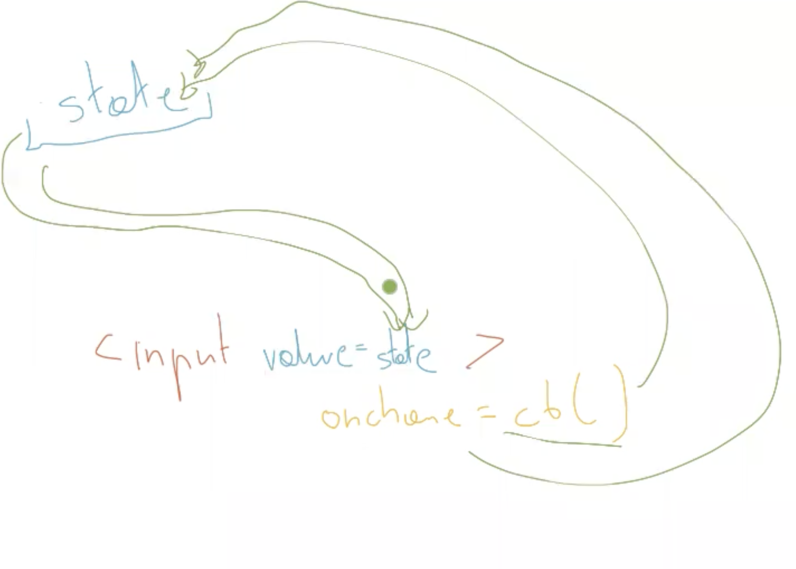

# Adopt me
React - GUI - SPA or PWA
## Dictionary

- CDN (Content Delivery Network) - server assets (js, css, images):
  (1)szybciej działa, bo uzytkownich ma w cachu zapamietana reactowa aplikacje - CDN z cache'
  (2) CDN robi assety w zonach na swiecie, przez co przesyl danych dziala tak samo w roznych czesciach swiata
- Transpilator (i.e. Babel Typescript) === transformation and compilation. Conversion between languages version.
- SPA - single page application (brak przeładowań strony, przypomina aplikacje desktopowe)
- PWA - progressive web apps - to SPA, ale działa bez internetu, np. starbucks - apka gdzie mozna zamówić i zapłacić za nią bez interentu
- SSR - server side rendering (piszemy aplikację, ale nie przeglądarka renderuje tą stronę tylko robi to server, działa szybciej niz normalna aplikacja plus wtedy google boty widzą ten HTML i mogą go indeksować)
- Memoizing - cache function result instead call it twice with the same parameters, only for pure functions and limited combination of parameters value

## Tools

- Prettier - code formatter [Link🔗](https://www.npmjs.com/package/prettier)

```bash
npm i -D prettier@3.2.5
```

- Linter (ESLint) - static code analyzer with quideline (Airbnb) [Link🔗](https://eslint.org/)

```bash
npm i -D eslint@9.1.1 eslint-config-prettier@9.1.0
```

- Module Bundler (Webpack, Parcel)
- Storybook - program do testowania komponentów, trzymanie templatów komponentów
- State Managment library - (Flux, Redux, Mobx)

##Snippets

```bash
npm view eslint versions
# npm view <package_name> version>
# npm view <package_name> versions>
```

example of supoorted browsers [Link🔗](https://browserslist.dev/)

```json

"browserlist":["last 2 versions", "not dead"]

```

```bash
// instalacja React Router
npm install react-router@6 react-router-dom@6

// plus plik .babelrc - BABEL słuzy do transpilacji = transforamcja + kompilacja
// dodatek Proposal Class Properties: aby moc zmienic sposob pisania klas w js
npm i -D @babel/plugin-proposal-class-properties@7.16.7
```

## Component
- funkcyjny - renderuje React.createElement()
- classowy - 2 warunki:
1. extends React.Component
2. metoda render(), która zwraca React.createElement()

Inny podział:
- stateless - nie mają stanu, do nich są dostraczane dane, lepsze - REUZYWALNE
- statefull - mają stan, mają dane:
1. k. funkcyjne stają się statfull uywając hookow useState i useReducer
1. k. classowe są statefull dzięki this.state i metodą przez dowiązanie prototypowe setState, setValue (ktore są asynchroniczne)


## Obsługa danych
1. state - zmiana stanu powoduje rerender strony
2. props (properties) - zmiana propsu powoduje rerender strony
3. ContextAPI (1.8gb ram na 1 tab - limit na pamięć- stackoverflow), duze aplikacje, które przetwarzają duza ilość danych muszą uzywać biblioteki do zarzadzania stanem - State managment library 
(np. Redux (to co flux, ale zakłada single store plus niemutowalny), Flux (multipule store -wiele stanów, ale kazdy musi być niemutowalny- nie mozna ich modyfikować- prz zmianie usuwaja stan i powstaje ich kopia), Mobx (programowanie asynchroniczne, najbardziej skomplikowany))

